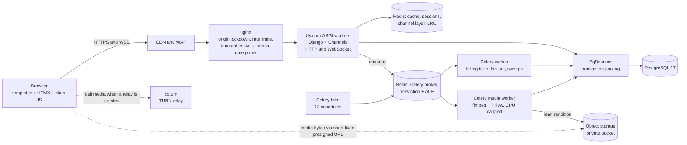
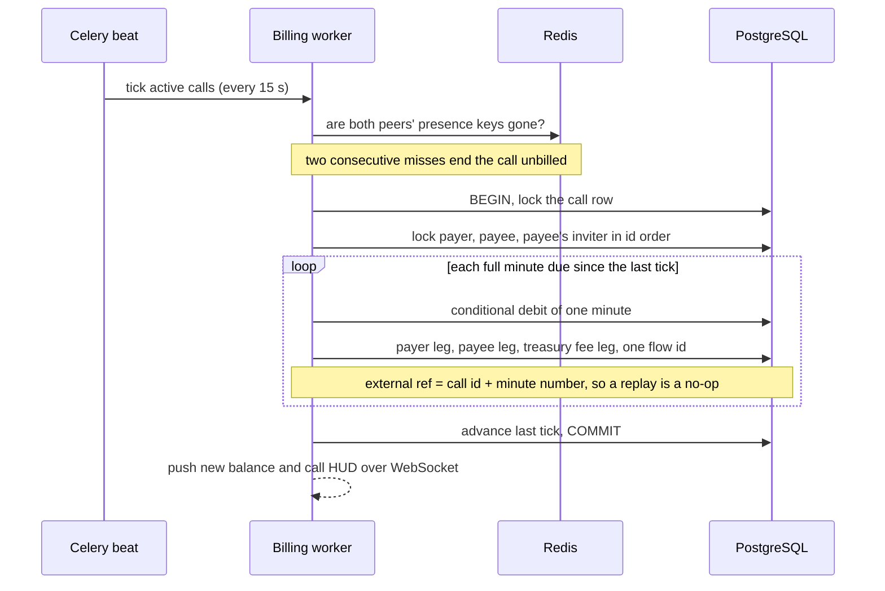
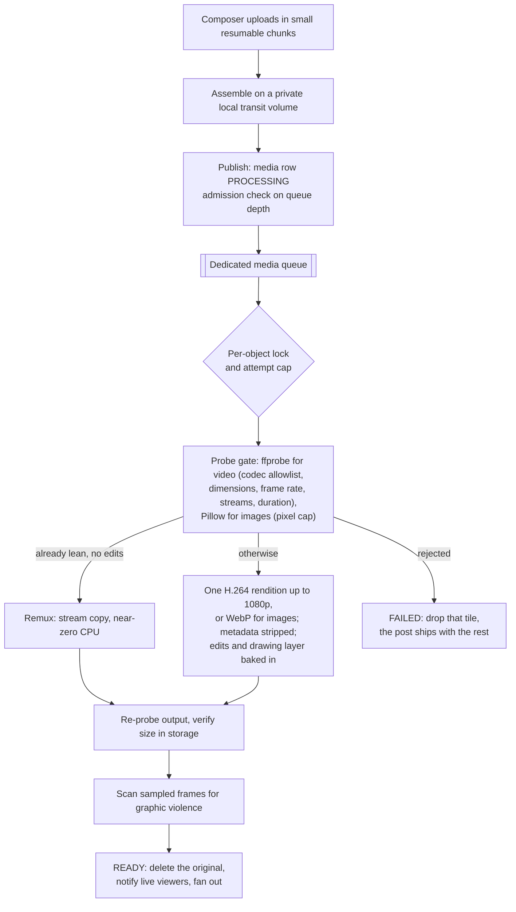

# BlinkDates: engineering case study

Author: Alex Isaev

BlinkDates is a creator platform. Fans pay creators per minute for one-to-one
video and voice calls, subscribe to their feeds, unlock paid posts, send tips
and chat with them. Creators publish posts, 24-hour stories made in an
in-browser editor with drawing, text and colour tools, and Blinks: short
vertical videos ranked by how people actually watch them. Every payment on the
site moves through one internal wallet, backed by an append-only, signed
ledger. The product is deployed on a single server behind a CDN; the public
launch is pending.

This repository is a write-up, not the code. The source is private because the
product is commercial and co-owned with one partner.

## Why it is interesting to an engineer

- **Money that cannot drift.** Two append-only journals, enforced by PostgreSQL
  triggers and signed with a per-row HMAC. Every purchase is a set of legs that
  sums to zero. A management command checks seven invariants and exits non-zero
  if any of them break.
- **Per-minute billing on a live WebRTC call.** A Celery beat ticker charges
  each minute as its own idempotent flow, under row locks taken in a fixed
  order, with a debit that cannot overdraw a wallet.
- **A media pipeline that survives a small server.** Chunked uploads, a
  dedicated CPU-capped transcode worker, a remux fast path, queue-depth
  admission control and a private bucket served through an access gate.
- **A ranker built on rates, not counts.** Blinks are scored on completion,
  replay and dwell rates with Bayesian smoothing, a cold-start term and
  per-author diversity. Money is deliberately not an input.
- **No SPA framework.** Server-rendered Django templates, Tailwind, HTMX and
  plain JavaScript, with a soft-navigation layer that keeps a live call running
  while the user moves around the site.

## At a glance

| Area | Detail |
|---|---|
| Backend | Python 3.12, Django 5.2, Django Channels 4 (ASGI on Uvicorn), Celery 5 with beat |
| Data | PostgreSQL 17 behind PgBouncer (transaction pooling), Redis 7 (two instances) |
| Real time | WebSockets over Channels, WebRTC peer-to-peer media, coturn for TURN relay |
| Media | ffmpeg, Pillow with HEIC support, Cloudflare R2 (private bucket, presigned URLs) |
| Frontend | Django templates, Tailwind CSS (standalone CLI at image build), HTMX, plain JavaScript, Fabric.js for the story editor, canvas and MediaRecorder for on-device story rendering |
| Edge | Cloudflare CDN in front of nginx; nginx in front of the app |
| Deployment | Docker Compose, 10 services on one host |
| Size | About 55,600 lines of application Python, 22,400 lines of Python tests, 53,500 lines of first-party JavaScript (vendored libraries excluded), 149 migrations |
| Tests | 1,418 Django test methods (counted); 168 Playwright tests on 6 device profiles, 1,008 test cases (last run: 781 passed, 227 skipped, 0 failed) |
| History | 543 commits in the private repository, late May to late September 2026 |

## Architecture



One ASGI process type serves both HTTP and WebSockets. The database sits
behind PgBouncer in transaction mode, so the Django settings turn off
persistent connections, server-side cursors and prepared statements. That
trade lets many web workers, WebSocket consumers and Celery threads share a
small, bounded pool of Postgres connections.

Redis runs as two instances on purpose, because their needs are opposite. The
cache must evict (LRU) so it never refuses a write. The Celery broker must
never evict, because an evicted queue entry is a task that silently vanishes;
it also writes an append-only file so a restart replays the queue. Transcode
locks and attempt counters live on the broker instance for the same reason.

Heavy media work runs on its own queue and its own container. That container
has a hard CPU and memory ceiling, runs one job at a time and runs ffmpeg at a
lower scheduler priority. Scaling is horizontal (more single-job replicas), and
a `make` target refuses any replica count whose combined CPU ceiling exceeds the
host's cores minus two, so encoding can never starve web requests or live
calls.

More detail, including the full service list, the beat schedule and the state
machines, is in [docs/architecture.md](docs/architecture.md).

## The money core

The rules live in a written "money constitution" that every change to payments
is checked against. In code it comes down to a small set of primitives.

**One currency.** Every account has one wallet balance with a database CHECK
of `>= 0`. Site features only ever spend and receive that balance. External
money enters only through a confirmed deposit and leaves only through a paid
withdrawal. A payment provider outage pauses top-ups and nothing else.

**Append-only journals.** A per-user wallet journal and a platform treasury
journal record every movement. PostgreSQL triggers reject every UPDATE and
DELETE on both. The one exception is a foreign key becoming NULL when an
account is erased: the books outlive accounts, anonymised, and still sum.
Mistakes are corrected with new compensating rows, never edits.

**A signature per row.** Each journal row carries an HMAC over its immutable
money fields, stamped at insert. The value is prefixed with the id of the key
that signed it, and verification looks that key up in a keyring. Rotating a key
adds an entry; it never turns history red. The keyring is set separately from
Django's `SECRET_KEY`, which is only the fallback for development and for rows
signed before the keyring existed. The limitation is written down: an attacker
who holds both the database and the key can forge signatures. The design
targets database-level tampering.

**Purchases as zero-sum flows.** One engine function runs every purchase. The
payer pays exactly the listed price `P`; the platform's commission `r` comes off
the recipient's side:

```
payer       -P
recipient   +P - fee          fee = round_half_up(P * r)
treasury    +fee - bonus
inviter     +bonus            bonus capped by the fee earned on this event
```

All legs share one flow id and commit in one transaction, so any purchase can
be reconstructed and every flow sums to zero. The commission rate is read once
and snapshotted into the treasury row, so changing a rate never rewrites
history or breaks a purchase in flight. Platform sales and gift payouts go
through the same engine; no other code is allowed to compute a fee.

**Overdraft-safe debits.** A debit is one conditional statement:
`UPDATE ... SET balance = balance - x WHERE id = ? AND balance >= x`. Zero rows
updated means insufficient funds, raised before any other leg lands. There is
no read-then-write window for two concurrent requests to race through, and the
CHECK constraint is the second line of defence. The debit and its journal row
share a savepoint, so a failed insert rolls the debit back with it.

**Idempotency.** Any credit or charge that can be retried from outside (a
webhook, a double-clicked button, a replayed billing minute) carries an
external reference. A unique index on `(kind, external_ref)` makes the second
attempt lose the insert; the savepoint rolls back its balance change and the
caller sees an explicit duplicate instead of a second charge.

**Ordered locks.** A flow can touch three wallets: payer, recipient and the
recipient's inviter (referral bonus). All of them are locked with
`SELECT ... FOR UPDATE` one row at a time in ascending id order, everywhere. A
tip and a call tick between the same two people can no longer take the locks in
opposite orders and deadlock.

**Per-minute call billing.**



The first minute is charged when the callee accepts, so a funded caller cannot
connect, talk for 59 seconds and hang up for free. Each later minute is its own
engine flow with a per-minute reference. Minutes due are computed from elapsed
time since the last billed tick, so a delayed or restarted beat catches up
without losing or doubling a minute. If the payer cannot cover the next minute,
billing stops cleanly at that minute and the tick anchor moves to "now", so a
later top-up is never charged retroactively. By product decision an empty
wallet does not hang up the call: the creator decides whether to keep talking,
and billing resumes at the next full minute after a top-up. Billing is driven
by the server only; the signalling socket never accepts wallet state from a
client.

**Deposits.** One state machine covers every provider. The wallet is credited
with what the provider verified actually arrived, never the amount requested.
Underpayments park for an operator and credit what arrived; a later completion
credits exactly the difference. Overpayments credit in full. An expired invoice
can still be resolved when real money lands late. Transitions are monotonic, so
a retried or out-of-order provider event cannot move a resolved deposit
backwards. A webhook signature proves who sent the callback, not how much was
paid, so the handler finds the deposit by the id we issued, cross-checks its
fields and parks anything unusual for a human. Every authentic callback is
stored once, append-only, in the same transaction as its outcome.

**Withdrawals.** The wallet is debited when a withdrawal is requested, so the
money cannot be spent twice while an operator processes it; reject or cancel
returns it exactly once. Requests are gated: identity verification is required,
recently deposited funds are held for a dispute window while earned funds are
available at once, per-account daily limits apply, and an account can have only
one open request at a time. A chargeback rejects any open withdrawals, claws
back what the wallet still holds, books the rest as a visible treasury loss and
deactivates the account. Deleting an account settles open withdrawals first,
and a payout that is approved but not yet paid blocks deletion.

**The audit.** `manage.py finance_audit` is read-only and checks:

1. Every wallet balance equals the sum of that user's journal rows.
2. Every flow sums to zero across both journals (deposit and withdrawal edges
   are carved out explicitly).
3. Every journal row's HMAC verifies under the key it names; an unsigned row is
   a failure.
4. No balance is negative.
5. Every fee row equals its gross amount times its own rate snapshot, rounded
   half-up to the cent.
6. Gift inventory lots agree with the inventory totals, and the treasury covers
   the payouts it still owes on gifts that were bought but not yet given.
7. Every resolved deposit's credits sum exactly to the amount received.

It exits non-zero on any failure, so a CI job or a cron alert can gate on it.
Today the test suite runs it after a mixed workload of unlocks, tips, platform
sales and gift transfers.

## Calls

Calls are peer-to-peer WebRTC. The application never touches call media; when
two peers cannot connect directly, coturn relays the still-encrypted stream. A
Channels consumer relays SDP offers, answers and ICE candidates between the two
people on the call; anyone else is refused at connect, as is any
unauthenticated socket. TURN credentials are minted per user with a one-hour
expiry using the shared-secret REST scheme, so the TURN secret never reaches a
browser.

Each connected peer refreshes a presence key in Redis. The billing ticker reads
those keys: two consecutive ticks with nobody on the line end the call without
billing, which bounds what a crashed pair of clients can cost. Unanswered rings
expire to "missed" with a notification for the callee, and an absolute age cap
closes abandoned rows. The creator sets the rate and the fan pays, whichever
side dialled.

## Media pipeline



- **Uploads.** Chunks are small enough to finish inside the CDN's origin
  timeout on a slow mobile uplink. Chunks and assembled sources stay on local
  disk under a prefix the media gate never serves; only the final rendition
  goes to object storage. Per-user in-flight caps, a global assemble limit and
  a free-disk floor stop uploads from filling the volume.
- **Where the encoding happens.** Posts and Blinks upload exactly as picked.
  An earlier version re-encoded clips on the phone first; that cost battery and
  heat, so the work moved back to the capped server worker. Stories are the
  exception (see below). Either way the device is never a trust boundary: the
  server re-probes whatever arrives.
- **Transcode.** ffmpeg runs with a file-only protocol whitelist, maps only the
  first video and audio streams and strips metadata and chapters. A clip that
  is already web-lean H.264 is stream-copied instead of re-encoded. The server
  is the authority on product rules: a Blink comes out at most 90 seconds long
  and vertical whatever the client sent. Images are re-encoded to WebP with
  orientation baked in and EXIF removed, behind a decompression-bomb pixel cap.
  The output is re-probed and its size in storage verified before the original
  is deleted.
- **Delivery.** Tasks use late acknowledgement, a per-object lock, an attempt
  cap for poison inputs and a broker visibility timeout longer than the hard
  time limit, so a running job is never handed to a second worker. A beat job
  re-enqueues post media stuck in PROCESSING (a stuck video story is dropped
  instead, and its author is asked to re-shoot it). When the queue is deep, new
  publishes get a 429 with a bucketed Retry-After instead of an unbounded
  backlog.
- **Stories.** The editor runs on a Fabric.js canvas: brush, text with
  per-line highlight chips, system fonts, colour filters, crop and undo. The
  drawing layer is exported as a PNG and baked into the pixels, so a viewer
  cannot strip it. Where the browser can record canvas output, the device
  renders the final 9:16 clip itself (canvas plus MediaRecorder) and the server
  only remuxes it; otherwise the server composites the layer with ffmpeg.
- **Serving.** The bucket is private. Every post, story and chat media request
  goes through an access check (owner, subscription, unlock, story visibility,
  chat participant) before the server issues a redirect to a presigned URL. The
  signed URL forces a safe content type and disposition, so a stored object can
  never render as HTML or SVG. Paid content gets a URL that lives for minutes
  and a no-store redirect, so losing access takes effect on the next request;
  free content gets a long private cache. Locked content gets a blurred teaser.

A plan to move video transcoding to a managed video service, with signed
playback URLs minted after the same access check, is written down but not
built yet.

## Feed and Blinks ranking

The ranker scores engagement as rates over server-counted impressions, never
raw counts. Each rate is smoothed toward the pooled platform mean with a
Beta-Binomial prior, then mapped through a bounded lift so no single signal can
run away with the score. Blinks weight completion and replay rates highest,
followed by engagement (likes, saves, comments) and dwell time per impression,
plus recency and an exploration term that gives new posts a fair chance.

The rules that keep it honest:

- The author's own views, likes, saves, comments and reports are excluded, both
  where they are written and in the aggregation SQL.
- One viewer's dwell time is capped, so one account cannot inflate a post.
- Reports only demote, by a bounded factor, and only when more than one
  person has an open report. Hiding content is a moderation decision, not a
  score.
- Per-author decay keeps one creator from filling a page.
- Revenue is not an input. The money columns were removed from the ranking
  tables rather than left dormant.

The aggregates are recomputed by one SQL statement inside PostgreSQL every ten
minutes (`INSERT ... ON CONFLICT DO UPDATE`), so ranking never adds a GROUP BY
to a page load.

## Security model

The order of priorities is written down: security and anti-fraud first, then
creators' earnings, then client experience. The measures that follow from it:

- **Edge and origin.** The origin answers only the CDN's published address
  ranges, so the WAF cannot be bypassed by hitting the server directly. nginx
  restores the real client IP from the CDN header and overwrites
  `X-Forwarded-For` with it, so rate limits key on a value a client cannot
  forge. Separate rate-limit tiers apply to credential endpoints, uploads,
  media and everything else. After a worker crash nginx retries only GET and
  HEAD, never a POST that may already have moved money.
- **Access.** Every view needs a login unless its URL name is on an explicit
  allowlist (the landing page, the sign-in flow, legal pages and a capped
  anonymous preview), and a second wall forces unfinished accounts through
  onboarding. WebSockets check the origin and the session; the call consumer
  admits only the two participants, and live post subscriptions reuse the
  access predicates of the HTTP views.
- **Accounts.** Brute-force lockout keys on the IP and username pair, so a
  stranger cannot lock someone out by failing their username. A CAPTCHA,
  verified server-side and failing closed, is always required to request a
  password reset (shown to everyone, so it cannot reveal which emails exist)
  and switches on per IP after repeated failures on sign-in and sign-up.
  Strong password rules, HttpOnly and SameSite cookies, CSRF protection,
  HSTS, open-redirect checks on `next` parameters, and no public
  username-availability oracle.
- **Headers.** An enforced Content-Security-Policy. Anonymous pages get a
  strict script policy with no inline scripts; signed-in pages still allow
  inline scripts while the last inline handlers are moved out. Frame, referrer
  and permissions policies; cross-origin opener and resource policies.
- **Messages.** Message text is encrypted at rest with AES-256-GCM, using a key
  derived with HKDF from its own setting, so `SECRET_KEY` can rotate without
  making old messages unreadable. Staff have no reader for conversations;
  moderation sees only a snapshot of a message that one of the two
  participants reported.
- **Infrastructure.** Redis requires a password, and production refuses to
  boot without one. Ports for the database and Redis are not published. The
  application image runs as a non-root user. Python dependencies are pinned to
  exact versions. Inbound webhooks are authenticated by signature.
- **Content.** Every profile photo passes a content check before it goes live,
  and a creator's photo must also show one clear, real face (no group, no
  illustration). The check runs on a cloud vision API by default or, by
  setting, on a self-hosted face detector and explicit-content classifier
  (ONNX Runtime, CPU only), and it fails closed. Post media is scanned after
  transcoding for real graphic violence; a hit holds the post and files a
  report in the staff queue. That scan fails open, so an outage never blocks a
  legitimate upload, and user reports back it up.
- **Failing visibly.** Where a guard has to fail open (rate limits during a
  Redis outage), it writes a throttled error to the log so the gap is never
  silent. Money events that need a human go to an admin chat, rate-limited so
  a failing provider sends one message per window rather than one per user.

## Testing

All numbers below were counted from the private repository for this write-up,
in early October 2026.

**Django: 1,418 test methods** in 287 test classes across 53 files, counted by
parsing the test modules (not by running them). By app: content 858, users
364, finance 138, live streaming 30, calls 17, staff panel 11. They run on a
fresh PostgreSQL test database. Under the test runner, Celery tasks execute
eagerly, email goes to memory and the cache moves to its own Redis database,
so a test run cannot reach a real person or a production worker.

Some of the suites that carry the most weight:

- Finance (41 tests): database immutability, keyring rotation, tamper
  detection, zero-sum flows, rate snapshots, half-up rounding, deposit edge
  cases, chargebacks, withdrawal gates, account deletion with open holds, and
  the audit command itself.
- Crypto deposit gateway (97 tests), mostly attacks and accidents: forged,
  malformed and oversized bodies; callbacks that do not match the invoice we
  issued, the coin or an already-credited transaction; the same body sent 31
  times crediting once; underpayment followed by completion; overpayment
  ceilings; a database failure mid-credit that the provider's retry heals;
  test-mode callbacks that must never credit; the append-only event log. Every
  outbound network call is patched, and a stray one fails the test.
- Ranking (54 tests), mostly adversarial: an author watching, liking or
  commenting on their own post; one viewer's unbounded watch time; report
  brigading against a popular post; a single report; one author flooding the
  feed; held and blocked posts; and a test proving the score cannot see money
  at all.
- Call billing: payer direction in both dial directions, the first-minute
  charge, the ticker's catch-up, and its stop at an empty wallet without
  hanging up or billing the gap later.

**Playwright: 168 tests in 18 spec files**, listed on six device profiles
(iPhone 14, iPhone SE, Pixel 7, iPad, desktop Chrome, desktop Safari): 1,008
test cases per pass, some of which skip on profiles they do not apply to. They
need no server: specs run against local fixture pages and pull the CSS and
JavaScript under test from the source tree. On a scratch copy of the tree with
no server running, the last full pass took 3.2 minutes: 781 passed, 227
skipped, none failed. They cover the story viewer's keyboard contract on iOS,
the bottom-sheet drag and focus rules, scroll locks, the comments sheet, draft
restore in the composer, rotation handling in the on-device encoder and the
top-up panel. A further 26 standalone acceptance and
verification scripts sit alongside them; for example, one drives WebKit
against a running instance to check that Blinks appear about once per screen
and never twice in a row.

**Linting.** stylelint with a custom rule for the mobile Safari traps this
codebase has actually hit, such as `position: fixed` combined with
`backdrop-filter`. On the current tree it reports no errors and 29 warnings,
all from that rule.

## Lessons from production

- **A cleanup job must never fail into deletion.** An hourly sweep deleted
  media rows whenever storage reported a file missing. During the move to
  object storage, the existence check briefly failed for everything. The sweep
  was removed; the replacement acts only on a confirmed, repeated miss for a
  single file, triggered by a real 404.
- **Immutable caching is a promise.** Static assets are served with
  content-hashed names and a one-year immutable cache. Clearing the static
  volume on every deploy broke that promise, and open tabs lost their CSS. The
  fix stamps sources at image build so a new image always re-copies, drops the
  clear, and prunes superseded files only after 14 days.
- **A healthy worker can be killed by its own supervisor.** Rare 502s with no
  traceback came from the ASGI server's worker health check, whose reply needs
  the GIL, killing busy workers. The timeout was raised, a cron watchdog now
  records host state within a minute of a worker death, and nginx replays only
  idempotent requests after a 502.
- **Tests must not share infrastructure with production.** Tasks queued by
  tests once reached a real worker. Test isolation is now enforced in settings,
  not by convention.

## What I owned

I designed, built and operate the system: architecture, data model, the money
core and its audit, calls and billing, the media pipeline, ranking, the
frontend, the security hardening, Docker and nginx configuration, deploys and
incident fixes. The product is co-owned with one partner, who shapes the
feature list with me.

I build with an AI coding agent. I direct it through written specifications (a
money constitution, a design system, a handover contract with hard rules) and
review its changes against them and against the invariant tests.

## How to run

This repository contains no source code, so there is nothing to run here. For
reference, the private repository runs as a Docker Compose stack driven by
`make`:

```
make rebuild        # build and restart app, workers, beat and nginx
make test           # Django suite on a fresh test database
make test-mobile    # Playwright device-emulation suite
make lint-css       # stylelint with the custom iOS rule
python manage.py finance_audit   # the seven money invariants
```

Secrets come from an environment file that is never committed.

## Licence

Copyright (c) 2026 Alex Isaev. All rights reserved. This repository holds a
written case study and diagrams only. The BlinkDates source code is private and
is not licensed for any use.
