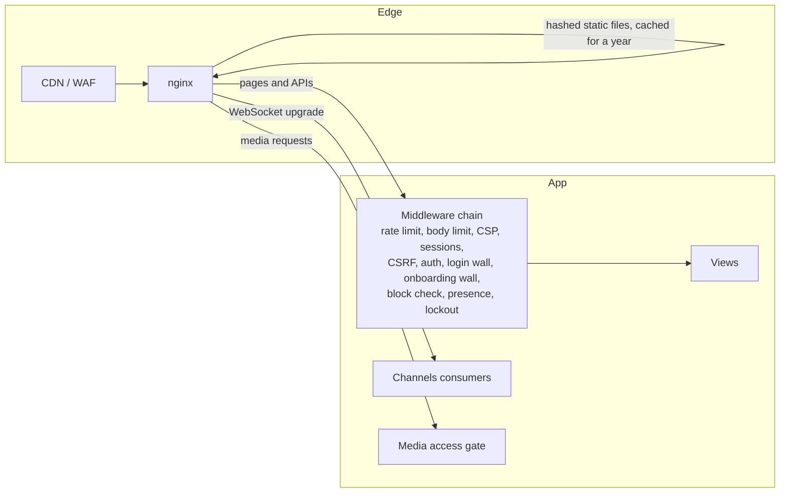
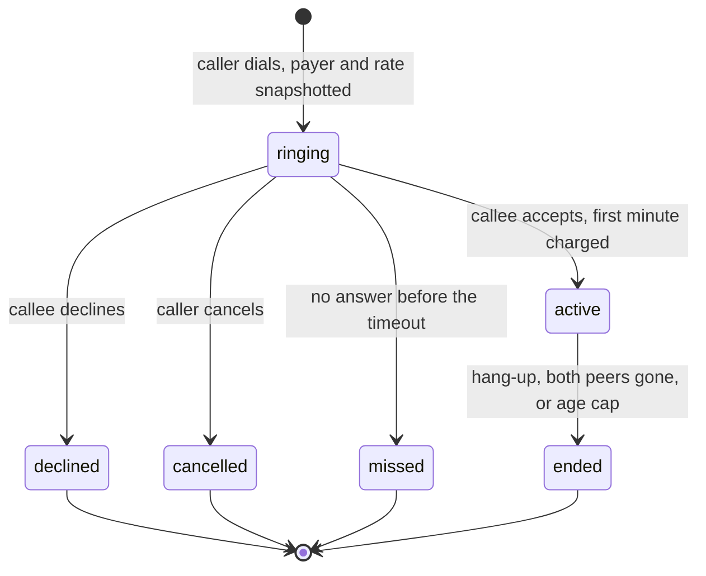
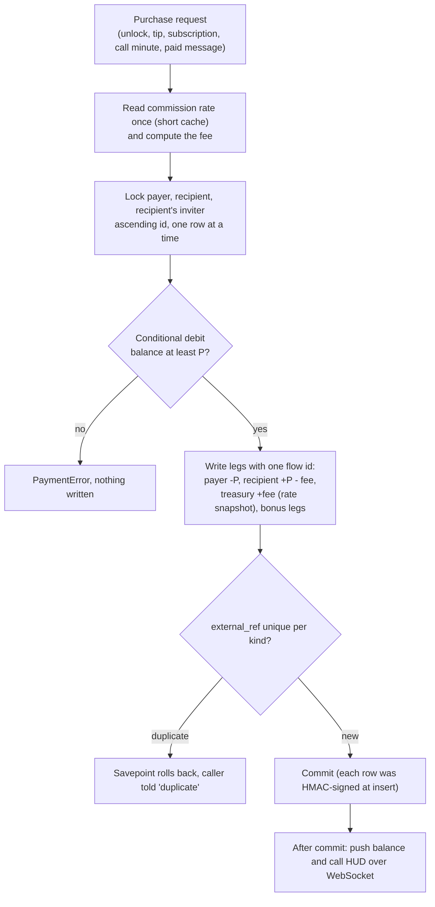
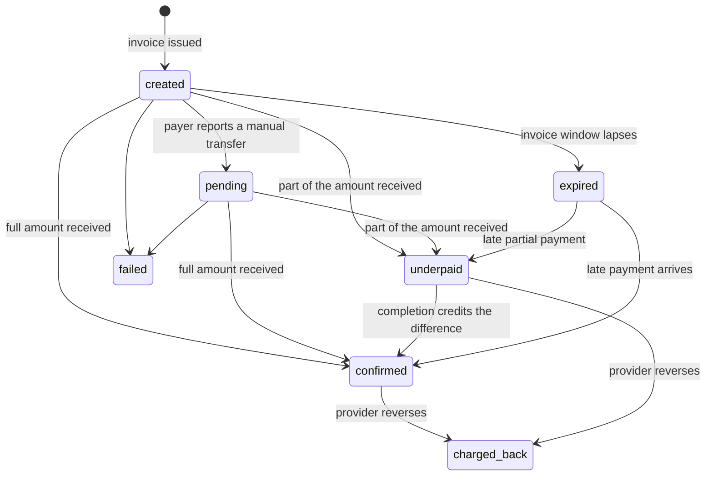
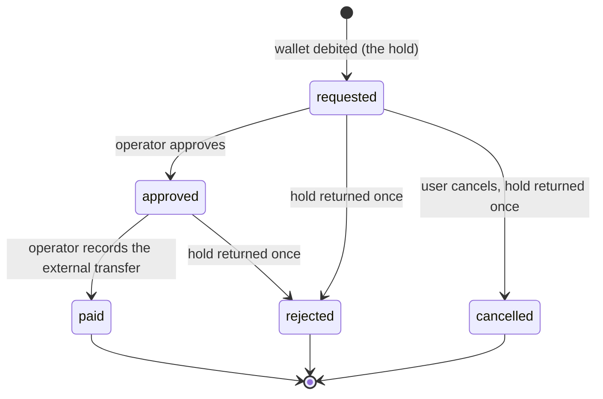
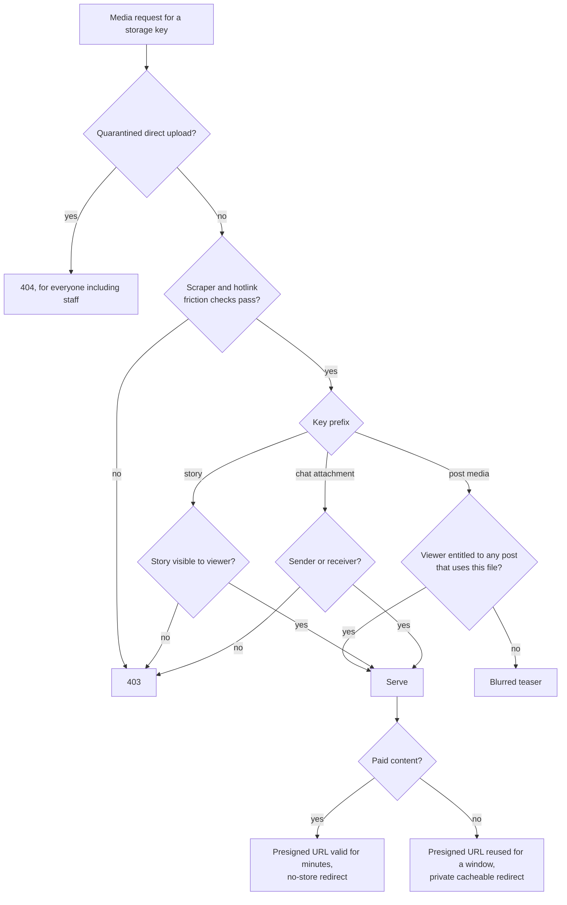

# BlinkDates: architecture notes

Author: Alex Isaev

This is the long version of the architecture section in the
[README](../README.md). It describes the system as built; the source itself is
private.

## Services

The whole product runs as one Docker Compose stack of ten services.

| Service | Role | Notes |
|---|---|---|
| `postgres` | PostgreSQL 17 | Not published to the host. |
| `pgbouncer` | Connection pooler | Transaction pooling, so Django runs with no persistent connections, no server-side cursors and no prepared statements. |
| `redis` | Cache, sessions, Channels layer | LRU eviction, password required. Sessions use a cached-database backend, so Postgres stays the source of truth and an evicted key never logs anyone out. |
| `redis-broker` | Celery broker, transcode locks | No eviction, append-only file, password required. |
| `app` | Uvicorn ASGI | Django and Channels in one process type, several workers, HTTP and WebSocket. Runs as a non-root user. |
| `celery` | Short-task worker | Billing ticks, notification fan-out, sweeps. Global five-minute task limit. |
| `celery-media` | Media worker | ffmpeg and Pillow. One job per replica, prefetch of one, CPU and memory ceilings, lower scheduler priority, its own per-task time limits. |
| `celery-beat` | Scheduler | 13 schedules, listed below. |
| `coturn` | TURN/STUN | Shared-secret authentication; credentials minted per user by the app. |
| `nginx` | Reverse proxy | TLS, origin lockdown to the CDN, rate limits, immutable static assets, media gate proxy, WebSocket upgrade. |

Every container that touches the database waits for Postgres, then runs
migrations under a Postgres advisory lock held on a direct (unpooled)
connection, so four containers booting at once cannot apply the same DDL
twice.

## Request paths

- **Pages.** Authenticated pages are server-rendered. A soft-navigation layer
  swaps only the page's content region, so the header, the notification
  socket and an active call overlay survive navigation. It uses the
  Navigation API where the browser has it and click, submit and popstate
  interception elsewhere. It drops its in-memory page snapshots when the
  session ends, and forces one full load when the server's build stamp
  changes so a long-lived tab never runs old code against new pages.
- **WebSockets.** Origin validation and the session stack run before routing.
  Consumers reject anonymous sockets. The call consumer admits only the two
  participants, and live post subscriptions use the same access predicates as
  the HTTP views, so a gated page cannot have an ungated live twin. Group
  payloads are serialised with msgpack, so every UUID is converted to a string
  before it is sent.
- **Media.** See the media gate below.
- **Static files.** Tailwind is compiled by its standalone CLI at image build.
  CSS `@import` chains are flattened and JavaScript bundles concatenated
  before content hashing, so a hash always describes the final bytes. Hashed
  files are served as immutable for a year; unhashed fallbacks revalidate on
  every use. Anonymous pages also get minified HTML, CSS and JavaScript.
  Superseded hashed files are pruned only after 14 days, because a browser or
  the CDN may still hold a page that points at them.

## Scheduled jobs

| Job | Interval | Purpose |
|---|---|---|
| Call billing tick | 15 s | Charge due minutes on active calls; end calls with no one on the line. |
| Expire unanswered calls | 10 s | Ringing calls become missed after a timeout; the callee gets a notification. |
| Expire stale active calls | 30 s | Absolute age cap for abandoned call rows. |
| Ledger reconciliation | daily | Observational parity and drift checks; never writes. |
| Renew paid listings | hourly | Charge or pause a creator's paid listing. |
| Renew subscriptions | hourly | Auto-renew at the subscription's own price snapshot, guarded by a cutover epoch. |
| Purge expired stories | 30 min | Delete expired story rows and their files. |
| Sweep orphan direct uploads | 10 min | Remove presigned uploads that were never finalised. |
| Reap stuck processing | 5 min | Re-enqueue stuck post media and photo stories; drop a stuck video story and ask its author to re-shoot. |
| Reap abandoned uploads | 30 min | Delete chunk sessions past their TTL. |
| Refresh feed pools | 150 s | Keep global ranking pools warm so no page load pays for them. |
| Refresh ranking stats | 10 min | One SQL upsert of the per-post aggregates. |
| Expire stale gateway deposits | 15 min | Close hosted-checkout invoices that never heard back (non-terminal). |

## Call lifecycle

- The rate is snapshotted on the call row at dial time, so a creator changing
  the price mid-call cannot change what is charged.
- Payer and payee are resolved by who sells the time, not by who dialled.
- Signalling is a stateless relay over a channel group. The application never
  sees call media; coturn relays the still-encrypted stream when the peers
  cannot connect directly.
- An empty wallet does not end the call. Billing stops at the last covered
  minute, the tick anchor moves to "now", and billing resumes at the next full
  minute after a top-up; the creator decides whether to keep talking.
- Each peer's consumer refreshes a presence key in Redis. A billing tick that
  finds both keys missing sets a strike; a second consecutive miss ends the
  call without charging. One missed tick (a tab in the background, a network
  blip) is forgiven.
- Every minute is its own purchase flow with a reference built from the call
  id and the minute number. A replayed minute fails the unique index and rolls
  back. Locks are taken on the call row first, then on the three wallets in
  ascending id order, then the engine runs without re-locking.

## Money: the flow engine

Supporting rules:

- **Rates.** One row per transaction kind in basis points, editable only from
  the staff panel. Every change writes an append-only log row. Reads are cached
  for 30 seconds; the applied rate is stored on the fee row.
- **Gifts as lots.** Gift inventory is stored as purchase lots carrying the
  price actually paid and the commission rate at purchase. Giving a gift
  consumes the oldest lot and pays out from that lot's own numbers, so
  repricing the catalogue or changing a rate later can never make the treasury
  pay out more than it was paid. Money the treasury still owes on bought but
  ungiven gifts is subtracted from what the owners may withdraw.
- **Referral bonuses.** Paid out of the margin the platform earned on that
  exact event and capped by it. When a gift's margin was already partly spent
  on a purchase bonus, the payout bonus can only use what remains.
- **Erasure.** Journal foreign keys are `SET NULL`. The immutability trigger
  allows exactly that update and nothing else.
- **Rounding.** Half-up to the cent everywhere, matching `NUMERIC(12,2)`, with a
  test pinning the boundary case.

## Deposit state machine

- `confirmed`, `failed` and `charged_back` are terminal. `expired` is not,
  because real money can arrive after an invoice window closes.
- The amount received only ever goes up. A resolution that does not raise it
  is a stale or replayed event and does nothing.
- Credits use the reference `dep:<id>` for the first credit and
  `dep:<id>:<cumulative>` for completions, so the credits for a deposit always
  sum to exactly what was received. The audit checks that sum.
- Money that arrives on an invoice that is already confirmed becomes a child
  deposit, so a late surplus is credited and still reconciles.
- Gateway rails can be off, staff-only or live. The webhook works in every
  mode, so an invoice issued before a rail was switched off still credits.
  A pause switch records and parks every would-be credit for a human.

## Withdrawal state machine

Every transition is a conditional update on the current status, so a double
click or a race moves a withdrawal at most once.

## Media gate

- The presigned URL carries a signed content type, disposition and cache
  policy. Only real image, video and audio types render inline; anything else
  is an opaque attachment, so a stored object can never be served as HTML or
  SVG.
- Paid bytes are never handed out as a direct URL inside a JSON payload; they
  always go back through the gate, which re-checks entitlement on every
  request.
- The existence check against storage is single-flighted and cached per key,
  so an expiring URL on a popular file does not trigger a stampede of storage
  round trips.
- A held post serves nothing, not even a teaser. Raw upload originals are never
  served to viewers and are deleted once the rendition is verified.
- Staff skip the viewer checks for post and story media, but not for chat
  media: they can open a chat attachment only if it is part of a reported
  message's snapshot.

## Ranking

All signals are rates over server-counted impressions from other people:

- **Engagement**: likes, saves and root comments from others, weighted (a save
  or a comment counts for more than a like), per impression.
- **Watch**: the mean of the completion rate and the replay rate.
- **Dwell**: seconds of attention per impression, with each viewer's
  contribution capped.
- **Risk**: open reports from distinct people per impression; zero below a
  minimum number of reporters.
- **Uncertainty**: `1 / sqrt(1 + impressions)`, the exploration term.

Each rate is smoothed as a Beta-Binomial posterior mean,
`(successes + prior_rate * k) / (trials + k)`, with the prior taken from the
pooled candidate set rather than a constant, so the bar rises with the
platform. Each smoothed rate goes through `lift(x) = x / (x + prior)`, which
puts the platform average at 0.5 and keeps every term between 0 and 1.

A Blink's score is a weighted sum of watch, dwell, engagement, recency and
uncertainty times recency, multiplied by `(1 - c * risk)` with `c` below one, so
reports can demote a post but never zero it. Selection then runs a lazy-heap
greedy pass that decays each author's later candidates geometrically, with a
floor, so a strong creator is throttled rather than erased.

The feed ranker uses the same primitives plus the viewer's interests:
categories, hashtags and creators they engage with, seeded from onboarding
picks until real behaviour outweighs them. Blocks, moderation holds and
deactivated authors are filtered in both code paths that turn a ranked list
back into posts, because cached rankings outlive those decisions.

## Operations

- **Deploys** rebuild the images; the app code is not bind-mounted, so a
  restart alone never ships new code.
- **Health**: a cheap nginx liveness endpoint and a Django health check that
  exercises the full boot path.
- **Alerts** go to an admin chat, rate-limited per alert: money events that
  need a human and failures nobody would otherwise see. A cron watchdog writes
  host load, memory and container state to a log within a minute of an ASGI
  worker dying, and also posts to that chat when chat alerts are configured.
- **Scaling plan** for video: move transcoding to a managed video service with
  signed playback URLs minted after the same access check. Designed, not built
  yet. An optional GPU encoder path already exists behind a setting and falls
  back to software on failure; it is off by default.
